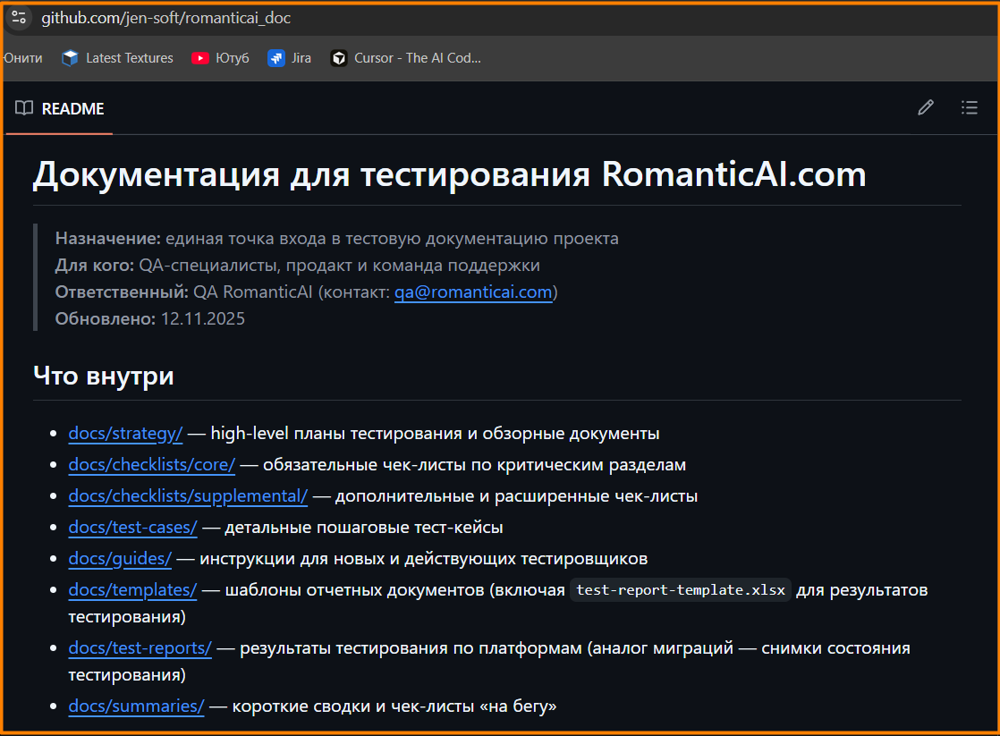
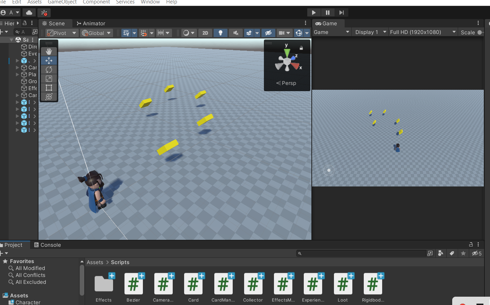
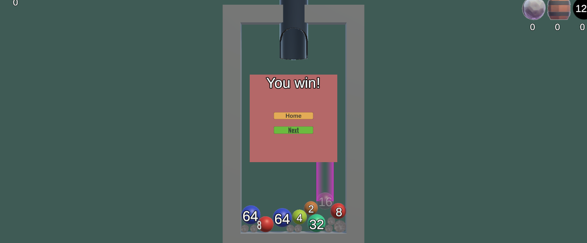
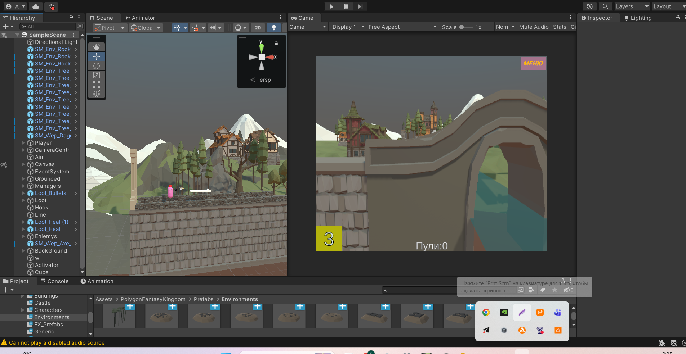
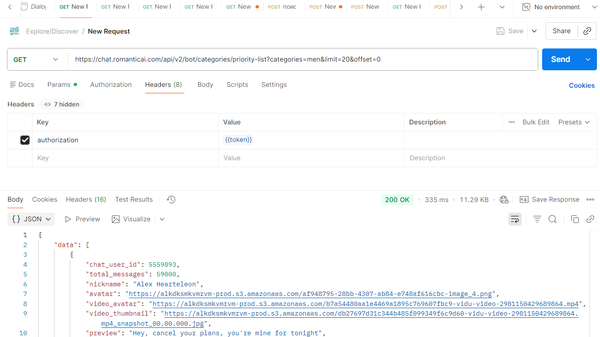

# Портфолио

## 📄 CV

[📥 Скачать CV (001_QA_Anatoli_Dicusar_2025.pdf)](001_QA_Anatoli_Dicusar_2025.pdf)

---

## О себе

Manual QA Engineer с опытом тестирования web, mobile платформ - один год. Тестировал мобильные приложения (iOS/Android) и работал с DevTools браузера, ручные API-проверки (Postman), GitHub/GitLab Issues. Интерес развиваться в тестировании профессионально. Мне так же привлекательна тематика мобильных игр - Game QA Unity, проверка игровых механик, Unity-прототипов, gameplay testing, VR технологии.

---

## Примеры работ

